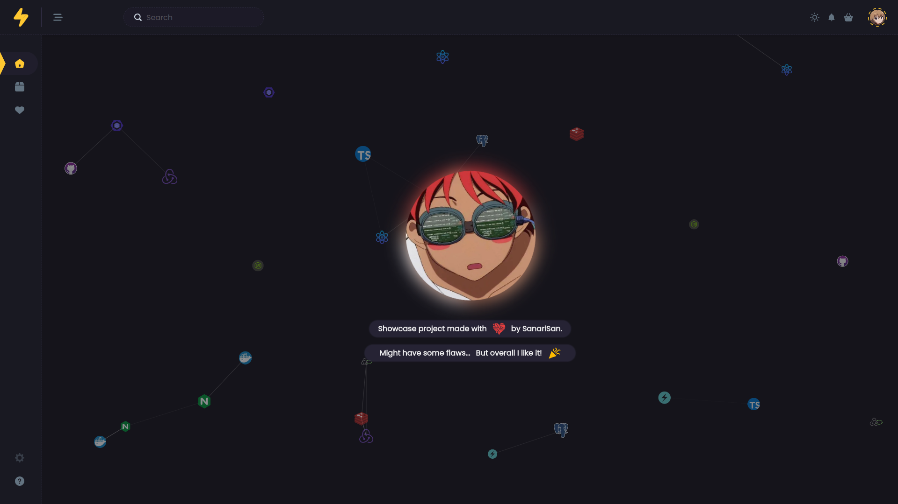

<h1>Fullstack tech store</h1>

<b>Showcase project</b>

<b><a href="https://market.nodejs.monster">https://market.nodejs.monster</a></b>

 

<!-- 

 -->

---

### Frontend:

- React
- Redux
- Redux-Saga
- React-window infinite scroll grid
- Chakra UI
- Theme switch (actually good)
- Api DTO validation
- Sass base
- Build runs inside docker container using two volumes (staging > prod) for live static content replacement (volume mounted to nginx) 

### Backend:

- Express
- Postgres
- Redis
- Nginx static / reverse api routing
- Session based auth
- Rate limit
- Docker / Compose
- Pub-Sub logging

### General:

- Node.js
- Typescript
- GH actions pipeline for CI/CD
- Auto SSL Nginx container routing using adopted [nginx-proxy-ssl](https://github.com/SanariSan/nginx-proxy-ssl) 
- Exhaustive eslint config